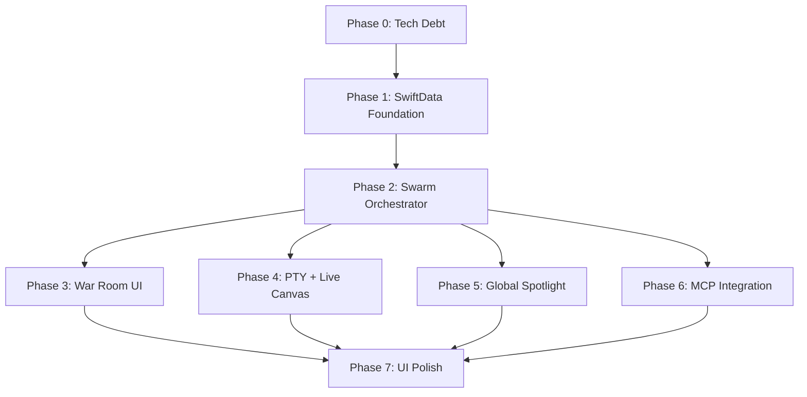

# Nvidia AI Studio v3.0 — Master Implementation Plan
*From Chat Wrapper to Autonomous Agent Operating System*

> **Status**: Approved for development on the `NvidiaAIStudio-Dev` branch.  
> **Database**: SwiftData (approved 2026-04-01).  
> **Target**: macOS 26+

---

## Phase 0: Technical Debt Resolution

> [!WARNING]
> These are V2 leftovers that **must** be resolved before building V3 on top. Skipping this phase means the Swarm inherits broken foundations.

### 0.1 Terminal ANSI Parsing
**Problem**: The PTY terminal renders raw XTerm escape sequences (`[?2004h`, `[?2004l`) as visible text instead of stripping them.  
**Root Cause**: `ANSIParser` regex does not account for private-mode CSI sequences.  
**Fix**: Extend the regex in `Utilities/ANSIParser.swift` to match `\x1b\[\?[0-9;]*[a-zA-Z]`.  
**Files**: `Utilities/ANSIParser.swift`

### 0.2 Chat Text Selection
**Problem**: Users cannot select/copy text from assistant message bubbles.  
**Root Cause**: The `MarkdownUI` renderer wraps content in non-selectable SwiftUI views.  
**Fix**: Wrap message content in `TextEditor(... isEditable: false)` or use `.textSelection(.enabled)` on the markdown container.  
**Files**: `Views/Chat/MessageBubbleView.swift`

### ✅ Success Criteria
- [ ] Terminal renders `brew upgrade` output without visible escape codes.
- [ ] User can triple-click to select a paragraph from any assistant message and Cmd+C to copy.

---

## Phase 1: SwiftData Foundation & Data Migration

### 1.1 SwiftData Container Bootstrap

#### [NEW] `App/DataContainer.swift`
Centralized SwiftData configuration. Isolated from `NvidiaAIStudioApp.swift` to keep the entry point clean.

```swift
import SwiftData

enum DataContainer {
    static func create() -> ModelContainer {
        let schema = Schema([
            AgentPersona.self,
            SwarmTask.self,
            SwarmMessage.self,
            SwarmDeliverable.self
        ])
        let config = ModelConfiguration(
            "NvidiaAIStudioSwarm",
            schema: schema,
            isStoredInMemoryOnly: false
        )
        return try! ModelContainer(for: schema, configurations: [config])
    }
}
```

#### [MODIFY] `App/NvidiaAIStudioApp.swift`
Inject the container at the root:
```swift
.modelContainer(DataContainer.create())
```

### 1.2 SwiftData Models

#### [NEW] `Models/AgentPersona.swift`
```swift
@Model
final class AgentPersona {
    @Attribute(.unique) var name: String
    var roleName: String           // "Senior Frontend Developer"
    var systemPrompt: String
    var avatarAssetName: String    // Maps to an asset catalog image
    var accentColorHex: String     // Each agent gets a signature color
    var allowedTools: [String]     // ["write_file", "run_command"]
    var isActive: Bool
    var createdAt: Date

    @Relationship(deleteRule: .cascade, inverse: \SwarmTask.assignedAgent)
    var tasks: [SwarmTask]
}
```

#### [NEW] `Models/SwarmTask.swift`
```swift
@Model
final class SwarmTask {
    var taskDescription: String
    var status: String             // "pending", "running", "completed", "failed"
    var priority: Int              // 0 = low, 1 = normal, 2 = urgent
    var logs: [String]             // Append-only execution log
    var createdAt: Date
    var completedAt: Date?
    var errorMessage: String?

    var assignedAgent: AgentPersona?

    @Relationship(deleteRule: .cascade, inverse: \SwarmMessage.task)
    var messages: [SwarmMessage]

    @Relationship(deleteRule: .cascade, inverse: \SwarmDeliverable.task)
    var deliverables: [SwarmDeliverable]
}
```

#### [NEW] `Models/SwarmMessage.swift`
Messages within a Swarm task context (distinct from Chat `Message`).
```swift
@Model
final class SwarmMessage {
    var role: String               // "user", "agent", "system", "moderator"
    var content: String
    var senderName: String         // Which agent or "CEO" (the user)
    var timestamp: Date

    var task: SwarmTask?
}
```

#### [NEW] `Models/SwarmDeliverable.swift`
The "physical object" an agent places in the user's Inbox.
```swift
@Model
final class SwarmDeliverable {
    var title: String              // "database_schema.sql"
    var type: String               // "file", "report", "image", "memory"
    var content: String            // Raw content or file path
    var mimeType: String?          // "text/plain", "image/png"
    var isRead: Bool
    var createdAt: Date

    var task: SwarmTask?
}
```

### 1.3 Legacy Data Migration Strategy

> [!IMPORTANT]
> Existing chat sessions stored as JSON in `~/Library/Application Support/NvidiaAIStudioDev/sessions/*.json` will **NOT** be migrated to SwiftData. The Chat system (`Session`, `Message`, `SessionStore`) remains untouched and continues to operate on JSON. SwiftData is used **exclusively** for the new Swarm system. This is a deliberate architectural boundary: Chat is linear, Swarm is concurrent. Mixing them invites bugs.

**Result**: Zero migration risk. Both systems coexist.

### ✅ Success Criteria
- [ ] `swift build -c debug` compiles with all 4 new `@Model` classes.
- [ ] App launches and creates the `.store` file in Application Support.
- [ ] Existing chat sessions load normally from JSON (no regression).

---

## Phase 2: Swarm Orchestrator Engine

### 2.1 The Core Loop

#### [NEW] `ViewModels/SwarmOrchestrator.swift`

An `@Observable` singleton that:
1. On `init`, starts a background `Task` polling every 2 seconds.
2. Fetches all `SwarmTask` where `status == "pending"`, sorted by priority.
3. For each pending task, looks up the `assignedAgent`, builds a system prompt from `AgentPersona.systemPrompt`, and calls `ProviderServiceFactory.chat(...)`.
4. Streams the response, appending `SwarmMessage` entries to the task's relationship.
5. On tool calls, executes them via `SkillRegistry` (reusing existing infrastructure).
6. On completion, sets `status = "completed"` and optionally creates a `SwarmDeliverable`.

**Key Design Decision — Event Bus (Mailbox)**:
```swift
@Observable
final class SwarmOrchestrator {
    // The mailbox: UI writes here, the running agent reads it
    var pendingDirectives: [UUID: String] = [:]  // taskID -> directive

    func postDirective(to taskID: UUID, message: String) {
        pendingDirectives[taskID] = message
    }
}
```
Inside the agent loop, between tool executions:
```swift
if let directive = pendingDirectives[task.id] {
    // Inject the user's message into the agent's context
    let msg = SwarmMessage(role: "moderator", content: directive, senderName: "CEO")
    task.messages.append(msg)
    pendingDirectives.removeValue(forKey: task.id)
    // The next LLM call will see this directive in context
}
```

This is the **Agent-in-the-Loop** mechanism. No Hard Kill. No stream cancellation. The agent reads the note at its next natural pause.

### 2.2 Concurrency Model

> [!CAUTION]
> SwiftData `ModelContext` is **not thread-safe**. Each background agent task must create its own `ModelContext` from the shared `ModelContainer`. Never share a `ModelContext` across tasks.

```swift
let context = ModelContext(container)
// All reads/writes for this agent happen on this context
```

### ✅ Success Criteria
- [ ] Drop a task via code: `SwarmTask(description: "Write a hello world script", status: "pending")`.
- [ ] Orchestrator picks it up, calls the LLM, and sets status to "completed".
- [ ] Post a directive mid-execution; the agent acknowledges it in its next response.

---

## Phase 3: The War Room (Spatial UX)

### 3.1 The Operations Floor

#### [NEW] `Views/WarRoom/OperationsFloorView.swift`

A spatial layout where each `AgentPersona` is rendered as a **Character Avatar** — not a card, not a square. A stylized character with:
- **Idle animation**: Subtle breathing/floating when waiting.
- **Working animation**: Typing motion or glowing aura when `status == "running"`.
- **Alert animation**: Head-turn or notification badge when a `SwarmDeliverable` is ready.

**Avatar Implementation**:
- Use Apple's native `Image` assets from an asset catalog (`Assets.xcassets/Avatars/`).
- Each `AgentPersona.avatarAssetName` maps to a named image set.
- We generate these avatar images using AI image generation tools during development and ship them as static assets in the bundle.
- Animations are achieved via SwiftUI `.transition`, `.scaleEffect`, and `TimelineView` for ambient motion.

**Layout**: A horizontal `ScrollView` with `LazyHGrid` — agents sit side by side at their "desks". Tapping an avatar expands a detail panel showing their live PTY output and task queue.

#### [MODIFY] `Views/ContentView.swift`
Add a top-level navigation mode:
```swift
enum AppMode: String { case chat, warRoom }
```
When `appMode == .warRoom`, render `OperationsFloorView` instead of `ChatView`.

#### [MODIFY] `Views/Sidebar/SidebarView.swift`
Add navigation item: **"War Room"** with a grid icon, placed above "Threads".

### 3.2 The Debate Room

#### [NEW] `Views/WarRoom/DebateRoomView.swift`

A specialized multi-agent conversation view, visually distinct from 1-on-1 chat:
- **Round table layout**: Avatars of participating agents sit around a virtual table.
- **Turn indicator**: A glowing highlight moves to whichever agent is currently "speaking".
- **CEO seat**: The user's position at the head of the table. They can interject at any time.

**Protocol — How Agents Debate**:
1. The user creates a `SwarmTask` with `type = "debate"` and assigns **multiple** `AgentPersona`.
2. The Orchestrator runs a **round-robin loop** with a configurable `maxRounds` (default: 5).
3. In each round, each agent receives the full conversation history (all previous `SwarmMessage` entries) and generates their response.
4. A hidden `system` message is injected: *"You are in a group debate. Read all previous messages from other participants. Build on, challenge, or refine their ideas. Keep responses focused."*
5. After `maxRounds`, a final `system` prompt is injected: *"Summarize the consensus reached. List any unresolved disagreements."*
6. The summary becomes a `SwarmDeliverable` placed in the user's Inbox.

**Safeguards**:
- **Token budget**: Each agent response is capped at 2000 tokens per round.
- **Infinite loop prevention**: Hard limit of `maxRounds`. If an agent repeats itself, the moderator system message says *"You have already stated this point. Offer a new perspective or yield."*

### 3.3 The Archives (Inbox)

#### [NEW] `Views/WarRoom/ArchivesView.swift`

A filing cabinet metaphor:
- **Unread items**: Highlighted with a subtle glow and badge count.
- **Item types**: Files (code, scripts), Reports (markdown summaries), Memories (key facts extracted from conversations).
- **Actions**: Open (renders content in a clean viewer), Forward (send to another agent as context), Delete.
- **Data source**: `@Query var deliverables: [SwarmDeliverable]` — SwiftData automatically updates this view when agents produce new output.

#### [NEW] `Views/WarRoom/DeliverableViewerView.swift`
A clean, full-width reading pane. Renders markdown for reports, syntax-highlighted code for scripts, and native image previews for visual assets.

### ✅ Success Criteria
- [ ] Operations Floor renders 3 agent avatars with idle animations.
- [ ] Tapping an avatar shows their task queue and live output.
- [ ] Debate Room: 2 agents successfully complete a 3-round debate on a technical topic.
- [ ] Archives: A completed task produces a deliverable visible in the Inbox.

---

## Phase 4: Agent Senses (PTY + Live Canvas)

**Dependency**: Requires Phase 2 (Orchestrator) to be functional.

### 4.1 PTY Auto-Pilot Binding

#### [MODIFY] `ViewModels/SwarmOrchestrator.swift`
When the Orchestrator spawns an agent that needs terminal access, it creates a dedicated `PTYProcess` instance and binds it to the agent's `SwarmTask`. The agent's `run_command` skill writes to `pty.write()` instead of spawning a blocking `Process()`.

#### [MODIFY] `Views/WarRoom/OperationsFloorView.swift`
When you click an agent avatar and they have an active PTY, the detail panel streams their terminal output live (reusing `TerminalContent.swift`).

### 4.2 Live Canvas

#### [NEW] `Views/RightPanel/LiveCanvasView.swift`
A `WKWebView` tab in the Right Panel. Auto-loads when a PTY agent starts a dev server (`localhost` regex detection). Vision loop captures screenshots on JS errors and feeds them back to the agent.

### ✅ Success Criteria
- [ ] Agent runs `npm start` via PTY; Live Canvas auto-loads the dev server.
- [ ] Agent detects a CSS error via screenshot and auto-corrects it.

---

## Phase 5: macOS Deep Integration (Global Spotlight)

**Dependency**: Requires Phase 2 (Orchestrator).

#### [NEW] `Views/Floating/SpotlightPanel.swift`
An `NSPanel` (floating, borderless) triggered by a global hotkey (`Cmd+Shift+Space`). The user types a task; it gets injected into the Swarm queue without opening the main window.

#### [MODIFY] `App/NvidiaAIStudioApp.swift`
Register the global hotkey using `NSEvent.addGlobalMonitorForEvents`.

### ✅ Success Criteria
- [ ] Hotkey summons the floating panel from any app.
- [ ] Typing a task and pressing Enter creates a `SwarmTask` visible in the War Room.

---

## Phase 6: MCP Swarm Integration

**Dependency**: Requires Phase 2 (Orchestrator).

#### [MODIFY] `ViewModels/SwarmOrchestrator.swift`
When building the tool list for an agent, dynamically merge tools from `SkillRegistry` (which includes active MCP servers like Puppeteer, Memory, etc.) with the agent's `allowedTools` whitelist.

### ✅ Success Criteria
- [ ] A background agent successfully uses an MCP tool (e.g., Puppeteer) without UI thread interaction.

---

## Phase 7: UI Polish & Themes

#### [MODIFY] `Models/AppTheme.swift`
Add two new themes:
- **Lights Out (OLED Dark)**: Pure `#000000` backgrounds, high-contrast text.
- **Nord / Arctic (Light)**: Clean light theme for daytime use.

#### [MODIFY] `Views/Settings/SettingsView.swift`
Inject `@Environment(AppState.self)` to ensure Settings respects the selected theme.

### ✅ Success Criteria
- [ ] Settings window background matches the app theme.
- [ ] "Lights Out" theme renders true black on all views.

---

## Execution Order & Dependencies



> [!NOTE]
> Phases 3, 4, 5, and 6 can run **in parallel** after Phase 2 is complete. Phase 7 is the final pass that unifies everything visually.

---

## Risk Analysis

| Risk | Impact | Mitigation |
|------|--------|------------|
| SwiftData thread safety violations | Crash on background agent writes | Each agent task creates its own `ModelContext` |
| Debate Room infinite loops | Token waste, frozen UI | Hard `maxRounds` cap + repetition detection |
| Avatar asset bundle size | DMG bloat | Use compressed PNG/WebP, max 5 avatars initially |
| PTY output flooding SwiftUI | UI freeze | Existing throttle pattern (150ms) from ChatViewModel |
| Global hotkey conflicts | Conflicts with Spotlight/Raycast | Use `Cmd+Shift+Space` (not `Cmd+Space`) |
